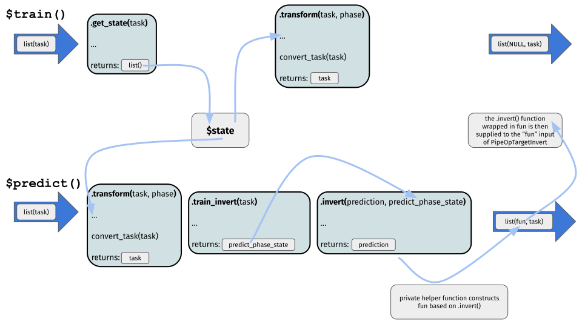

```{r setup, include=FALSE}
knitr::opts_chunk$set(
  echo = TRUE,
  R.options = list(width = 80)
)
library(mlr3book)
```

FIXME: ref links for new PipeOps etc when new mlr3pipelines hits CRAN.

Transforming the target variable often can lead to predictive improvement and is a widely used tool. Typical transformations are for example the $\log$ transformation of the target aiming at minimizing (right) skewness, or the Box Cox and Yeo-Johnson transformations being more flexible but having a similar goal.

One option to perform, e.g., a $\log$ transformation would be to manually transform the target prior to training a `r ref("Learner", "Learner")` (or predicting from it) and then manually invert this transformation via $\exp$ after predicting from the `Learner`. This is quite cumbersome. Especially if the transformation and inverse transformation require information about both the training and prediction data.

In this post, we show how to do various kinds of target transformations using `r mlr_pkg("mlr3pipelines")` and explain the design of the target transformation and inversion `r ref("PipeOp", "PipeOps")`.

You will:

* learn how to do simple target transformations using `PipeOpTargetTrafoSimple`

* be introduced to the abstract base class to implement custom target transformations, `PipeOpTargetTrafo`

* implement a custom target transformation PipeOp, `PipeOpTargetTrafoBoxCox`

As a prerequisite, you should be quite familiar with mlr3pipelines, i.e, know about the `$state` field of `PipeOp`s, input and output channels, as well as `r ref("Graph", "Graphs")`. We will start with a PipeOp for simple target transformations, `PipeOpTargetTrafoSimple`.

In all sections we will use the `r ref("mlr_tasks_mtcars", "mtcars")` regression `r ref("Task", "task")` with `mpg` being a numerical, positive target:

```{r}
library(mlr3)
library(mlr3learners)
library(mlr3pipelines)
set.seed(2906)

task = tsk("mtcars")
summary(task$data(cols = task$target_names))
```

Moreover, as a `Learner` we will use an ordinary linear regression learner:

```{r}
learner_lm = lrn("regr.lm")
```

# Simple Target Transformations

The term *simple* refers to transformations that are given by a function of the target, relying on no other arguments (constants are of course allowed). The most prominent example is given by the $\log$ transformation which we can later invert by applying the $\exp$ transformation.

If you are only interested in doing such a transformation and you do not have the time to read more of this post, simply use the following syntactic sugar:

```{r}
g_ppl = ppl("targettrafo", graph = learner_lm)
g_ppl$param_set$values$targettrafosimple.trafo = function(x) log(x)
g_ppl$param_set$values$targettrafosimple.inverter = function(x) exp(x)
```

This constructs a `Graph` that will $\log$ transform the target prior to training the linear regression learner (or predicting from it) and $\exp$ transform the target after predicting from it.
Note that you can supply any other `Learner` or even a whole Graph as the `graph` argument.

Now, we will go into more detail about how this actually works:

We can perform a $\log$ transformation of our numerical, positive target, `mpg`, using `PipeOpTargetTrafoSimple` (by default, `ppl("targettrafo")` uses this target transformation `PipeOp`):

```{r}
trafo = po("targettrafosimple", param_vals = list(trafo = function(x) log(x)))
```

We have to specify the `trafo` parameter as a function of `x` (which will internally be evaluated to be the target of the `Task`): `trafo = function(x) log(x))`.
In principle, this is all that is needed to transform the target prior to training a `Learner` (or predicting from it), i.e., if we now train this `PipeOp`, we see that the target is transformed as specified:

```{r}
trafo$train(list(task))$output$data(cols = task$target_names)
```

After having predicted from the `Learner` we could then proceed to apply the inverse transformation function in a similar manner. However, in `mlr3pipelines`, we decided to go with a more unified design of handling target transformations. In all target transformation `PipeOp`s also the inverse transformation function of the target has to be specified. Therefore, in `PipeOpTargetTrafoSimple`, the parameter `inverter` also has to be correctly specified, i.e.:

```{r}
trafo$param_set$values$inverter = function(x) exp(x)
```

To actually carry out the inverse transformation function after predicting from the `Learner`, we then rely on `PipeOpTargetInverter`. `PipeOpTargetInverter` has an empty `r ref("ParamSet", "ParamSet")` and its sole purpose is to apply the inverse transformation function after having predicted from a `Learner` (note that this whole design of target transformations may seem somewhat over-engineered, however, we will learn of its advantages when we later move to the advanced section).

`PipeOpTargetInverter` has two input channels named `"fun"` and `"prediction"`. During training, both take `NULL` as input (because this is what a `Learner`'s `"output"` output and `PipeOpTargetTrafoSimple`'s `"fun"` output will return during training). During prediction, the `"prediction"` input takes a `r ref("Prediction", "Prediction")`, and the `"fun"` input takes the `"fun"` output from `PipeOpTargetTrafoSimple` (you may have noticed already, that `PipeOpTargetTrafoSimple` has actually two outputs, `"fun"` and `"output"`, with `"fun"` returning `NULL` during training and a function during prediction, while `"output"` always returns the transformed input `Task`). We can see this, if we look at:

```{r}
trafo$output
trafo$predict(list(task))
```

We will talk more about the technical details here in the advanced section. To finally construct our target transformation pipeline, we build a `Graph`:

```{r}
g = Graph$new()
g$add_pipeop(trafo)
g$add_pipeop(learner_lm)
g$add_pipeop(po("targetinverter"))
```

Manually connecting the edges is quite cumbersome. First we connect the `"output"` output of `"targettrafosimple"` to the `"input"` input of `"regr.lm"`:

```{r}
g$add_edge(src_id = "targettrafosimple", dst_id = "regr.lm",
  src_channel = 2, dst_channel = 1)
```

Then we connect the `"output"` output of `"regr.lm"` to the `"prediction"` input of `"targetinverter"`:

```{r}
g$add_edge(src_id = "regr.lm", dst_id = "targetinverter",
  src_channel = 1, dst_channel = 2)
```

Finally, we connect the `"fun"` output of `"targettrafosimple"` to the `"fun"` input of `"targetinverter"`:

```{r}
g$add_edge(src_id = "targettrafosimple", dst_id = "targetinverter",
  src_channel = 1, dst_channel = 1)
```

This graph (which is conceptually the same graph as constructed via the `ppl("targettrafo")` syntactic sugar above) looks like the following:

```{r}
g$plot()
```

We can then finally call `$train()` and `$predict()` (prior to this we wrap the `Graph` in a `GraphLearner` and here we do have to set the `task_type` manually, because `PipeOpTargetInverter` does not expose its prediction type):

```{r}
gl = GraphLearner$new(g, task_type = "regr")
gl$train(task)
gl$state
gl$predict(task)
```

and contrast this with `$train()` and `$predict()` of the linear regression learner (also look at the estimated coefficients of the linear regression contained in `$state$model`):

```{r}
learner_lm$train(task)
learner_lm$state
learner_lm$predict(task)
```

You should continue reading, if you are interested in more advanced target transformations, i.e., where the transformation and inverse transformation require information about both the training and prediction data.

First we will introduce the abstract base class for doing target transformations, `PipeOpTargetTrafo`, from which `PipeOpTargetTrafoSimple` inherits.

# Abstract Base Class: PipeOpTargetTrafo

No matter how "complicated" the actual target transformation and inverse transformation may be, applying the inverse transformation function after having predicted from a `Learner` will always be done via `PipeOpTargetInverter` (as already outlined above, `PipeOpTargetInverter` has an empty ParamSet and its sole purpose is to apply the inverse transformation function after having predicted from a `Learner`). All `Graph`s for doing target transformations will therefore look similar like the simple one above, i.e., a target transformation `PipeOp` followed by some `Learner` or a whole `Graph`, followed by `PipeOpTargetInverter`. Therefore, using `ppl("targettrafo")` to construct such `Graph`s is highly recommended.

To allow for more advanced target transformations, we now have a closer look at the abstract base class, `PipeOpTargetTrafo`:

`PipeOpTargetTrafo` has one input channel, named `"input"` taking a `Task` both during training and prediction.
It's two output channels are named `"fun"` and `"output"`. During training `"fun"` returns `NULL` and during prediction `"fun"` returns a function that will be used by PipeOpTargetInverter to perform the inverse target transformation based on `PipeOpTargetInverter`'s `"prediction"` input. `"output"` returns the modified input `Task`.

Inherited classes should overload four functions:

* `set_state()` takes the input `Task` and returns a `list()` which will internally be used to set the `$state`. Typically it is sensible to make use of the `$state` during `train_target()` and `train_invert()`

* `train_target()` takes the input `Task` and returns a modified `Task` (i.e., the task with the transformed target).
  This is the main function for doing the actual target transformation. Note that `set_state()` is evaluated a single time during training right before `train_target()` and therefore, you can rely on the `$state` that has been set. To update the input `Task` with respect to the transformed target, inherited classes should make use of the private `$.update_target()` function which itself will call `convert_task()` and drop the original target from the `Task`.

* `train_invert()` takes the input `Task` and returns a `predict_phase_control` object. This can be anything. Note that `train_invert()` should not modify the input `Task`.

* `inverter()` takes a `Prediction` and a `predict_phase_control` object as inputs and returns a `Prediction`. This is the main function for specifying the actual inverse target transformation that will later be carried out by `PipeOpTargetInverter`. Internally a private helper function will construct the function that will be returned by the `"fun"` output of `PipeOpTargetTrafo` so that `PipeOpTargetInverter` can later simply dispatch this inverse target transformation on its `"prediction"` input.

The supposed workflow of a class inherited from `PipeOpTargetTrafo` is given in the following figure:

```{r, echo = FALSE, out.width = "100%"}

```

To solidify our understanding we will design a new target transformation `PipeOp` in the next section: `PipeOpTargetTrafoBoxCox`

# Hands on: PipeOpTargetTrafoBoxCox

The Box-Cox transformation of a target $y_{i}$ is given as:

$$y_{i}(\lambda) = \begin{cases}
\frac{y_{i}^{\lambda} - 1}{\lambda} & \text{if}~\lambda \neq 0; \\
\log(y_{i}) & \text{if}~\lambda = 0
\end{cases}$$

`mlr3pipelines` already supports the Box-Cox transformation for numerical, positive features, see `?PipeOpBoxCox`.

Here we will design a `PipeO`p to apply the Box-Cox transformation as a target transformation. The $\lambda$ parameter of the transformation is estimated during training and used for both training and prediction transformation. After predicting from a `Learner` we will as always apply the inverse transformation function. To do the actual transformation we will use `bestNormalize::boxcox()`.

First, we inherit from `PipeOpTargetTrafo` and overload the `initialize()` function:

```{r, eval = FALSE}
PipeOpTargetTrafoBoxCox = R6Class("PipeOpTargetTrafoBoxCox",
  inherit = PipeOpTargetTrafo,
  public = list(
    initialize = function(id = "targettrafoboxcox", param_vals = list()) {
      ps = ParamSet$new(params = list(
        ParamLgl$new("standardize", default = TRUE,
          tags = c("train", "boxcox")),
        ParamDbl$new("eps", default = 0.001, lower = 0,
          tags = c("train", "boxcox")),
        ParamDbl$new("lower", default = -1L,
          tags = c("train", "boxcox")),
        ParamDbl$new("upper", default = 2L,
          tags = c("train", "boxcox"))
      ))
      super$initialize(id = id, param_set = ps, param_vals = param_vals,
        packages = "bestNormalize")
    },
```

As parameters, we allow `"standardize"` (whether to center and scale the transformed values to attempt a standard normal distribution), `"eps"` (tolerance parameter to identify if the $\lambda$ parameter is equal to zero), `"lower"` (lower value for the estimation of the $\lambda$ parameter) and `"upper"` (upper value for the estimation of the $\lambda$ parameter).

Second, we overload the four functions as mentioned above.

We start with `set_state()`:

```{r, eval = FALSE}
    set_state = function(task) {
      checkmate::assert_r6(task, classes = "TaskRegr")
      target = task$data(cols = task$target_names)[[1L]]
      bc = invoke(bestNormalize::boxcox, target,
        .args = self$param_set$get_values(tags = "boxcox"))
      bc$x.t = NULL
      bc$x = NULL
      list(bc = bc)
    },
```

We assert that the input task is of class `r ref("TaskRegr", "TaskRegr")`  and apply the Box-Cox transformation to the target. This yields an object of class `"boxcox"` which we will wrap in a `list()` and set as the `$state` (`bc$x.t = NULL` and `bc$x = NULL` is done to save some memory because we do not need the transformed original data and original data here).

Next, we tackle `train_target()`:

```{r, eval = FALSE}
    train_target = function(task) {
      target = task$data(cols = task$target_names)[[1L]]
      new_target = as.data.table(predict(self$state$bc, newdata = target))
      colnames(new_target) = paste0(task$target_names, ".bc")
      task$cbind(new_target)
      private$.update_target(task, new_target = colnames(new_target))
    },
```

This is quite straightforward, because objects of class `"boxcox"` have their own predict method which we can use here to carry out the actual Box-Cox transformation based on the learned $\lambda$ parameter as stored in the `"boxcox"` object in the `$state` (both during training and prediction). We then rename the target, add it to the task and finally update the task with respect to this new target.

Time to overload `train_invert()`:

This is even more straightforward, because the prediction method for objects of class `"boxcox"` directly allows for inverting the transformation via setting the argument `inverse = TRUE`. Therefore, we only need the `"boxcox"` object stored in the `$state`.

```{r, eval = FALSE}
    train_invert = function(task) {
      self$state$bc
    },
```

Finally, we overload `inverter()`:

```{r, eval = FALSE}
    inverter = function(prediction, predict_phase_control) {
      checkmate::assert_r6(prediction, classes = "PredictionRegr")
      type = prediction$task_type
      truth = prediction$truth
      response = prediction$response
      truth = predict(predict_phase_control, newdata = truth,
        inverse = TRUE)
      response = predict(predict_phase_control, newdata = response,
        inverse = TRUE)
      get(mlr_reflections$task_types[type]$prediction)$new(
        row_ids = prediction$row_ids, truth = truth, response = response
      )
    }
  )
)
```

We assert that the input prediction is of class `r ref("PredictionRegr", "PredictionRegr")` and extract the truth and the response from the `Prediction`. We then apply the inverse Box-Cox transformation to both the truth and the response based on the $\lambda$ parameter and the mean and standard deviation learned during training, relying on the `predict_phase_control` object (which we specified while overloading `train_invert()`, i.e., this is just the `"boxcox"` object stored in the `$state`). Finally, we construct a new `Prediction` object.

```{r, echo = FALSE}
PipeOpTargetTrafoBoxCox = R6Class("PipeOpTargetTrafoBoxCox",
  inherit = PipeOpTargetTrafo,
  public = list(
    initialize = function(id = "targettrafoboxcox", param_vals = list()) {
      ps = ParamSet$new(params = list(
        ParamLgl$new("standardize", default = TRUE,
          tags = c("train", "boxcox")),
        ParamDbl$new("eps", default = 0.001, lower = 0,
          tags = c("train", "boxcox")),
        ParamDbl$new("lower", default = -1L,
          tags = c("train", "boxcox")),
        ParamDbl$new("upper", default = 2L,
          tags = c("train", "boxcox"))
      ))
      super$initialize(id = id, param_set = ps, param_vals = param_vals,
        packages = "bestNormalize")
    },

    set_state = function(task) {
      assert_r6(task, classes = "TaskRegr")
      target = task$data(cols = task$target_names)[[1L]]
      bc = mlr3misc::invoke(bestNormalize::boxcox, target,
        .args = self$param_set$get_values(tags = "boxcox"))
      bc$x.t = NULL
      bc$x = NULL
      list(bc = bc)
    },

    train_target = function(task) {
      target = task$data(cols = task$target_names)[[1L]]
      new_target = as.data.table(predict(self$state$bc, newdata = target))
      colnames(new_target) = paste0(task$target_names, ".bc")
      task$cbind(new_target)
      private$.update_target(task, new_target = colnames(new_target))
    },

    train_invert = function(task) {
      self$state$bc
    },

    inverter = function(prediction, predict_phase_control) {
      assert_r6(prediction, classes = "PredictionRegr")
      type = prediction$task_type
      truth = prediction$truth
      response = prediction$response
      truth = predict(predict_phase_control, newdata = truth,
        inverse = TRUE)
      response = predict(predict_phase_control, newdata = response,
        inverse = TRUE)
      get(mlr_reflections$task_types[type]$prediction)$new(
        row_ids = prediction$row_ids, truth = truth, response = response
      )
    }
  )
)
```

To construct our final target transformation `Graph` with our linear regression learner, we again simply make use of `ppl("targettrafo")`:

```{r}
g_bc = ppl("targettrafo", graph = learner_lm,
  trafo_pipeop = PipeOpTargetTrafoBoxCox$new())
```

The following plot should already look quite familiar:

```{r}
g_bc$plot()
```

Finally we `$train()` and `$predict()` on the task (again, we wrap the `Graph` in a `GraphLearner`):

```{r}
gl_bc = GraphLearner$new(g_bc, task_type = "regr")
gl_bc$train(task)
gl_bc$state
gl_bc$predict(task)
```

We could now proceed to benchmark our different target transformations:

```{r}
lgr::get_logger("mlr3")$set_threshold("warn")
bg = benchmark_grid(list(task), learners = list(learner_lm, gl, gl_bc),
  resamplings = list(rsmp("cv", folds = 10)))
b = benchmark(bg)
```

```{r}
b$aggregate(msr("regr.mse"))
```
