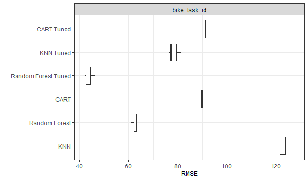

```{r setup, include=FALSE}
knitr::opts_chunk$set(
  echo = TRUE,
  R.options = list(width = 80)
)
library(mlr3book)
# Re-calculate all intermediary results instead of reading them from saved RDS
long_run = FALSE
```

# Preamble

The following examples were created as part of the Introduction to Machine Learning Lecture at LMU Munich.
The goal of the project was to create and compare one or several machine learning pipelines for the problem at hand together with exploratory analysis and an exposition of results.
The posts were contributed to the mlr3gallery by the authors and edited for better legibility by the editor.
We want to thank the authors for allowing us to publish their results.
Note, that correctness of the results can not be guaranteed. 

# Intro

Bike sharing is a network of publicly shared bicycles that can be rented for a certain period of time at different locations within a city and then returned at any station.
For the suppliers of those networks, it is important to always have enough bicycles available, whereby the demand depends on a variety of factors.
Therefore it is essential to have a forecasting system that predicts the demand taking into account several variables.
In this document, we develop such a system using the `mlr3verse` package.
For our analysis, we used the [Kaggle Bike Sharing Demand](https://www.kaggle.com/c/bike-sharing-demand/data) data set, which was provided by Hadi Fanaee Tork using data from Capital Bikeshare. [@Fanaee]
After ingesting the data into R we continue with some descriptive statistics for our training data set. 
We then preprocess the data and carry out feature and target engineering.
Afterwards we proceed with the modeling process in which we fit, tune and benchmark the *KNN*, *CART* and *RandomForest* learner of the `mlr3verse` package.
We conclude with our model prediction for the data.

## Prerequisites

This tutorial assumes familiarity with the basics of `r mlr_pkg("mlr3tuning")` and `r mlr_pkg("mlr3pipelines")`.
Consult the [mlr3book](https://mlr3book.mlr-org.com/pipelines.html) if some aspects are not  fully understandable.

```{r lib}
# rmd
library(knitr)
library(kableExtra)
# descriptive
library(ggplot2)
library(DataExplorer)
library(GGally)
library(ggrepel)
# tools
library(dplyr)
library(lubridate)
library(tidyr)
# analytic
library(mlr3verse)
```

Note, that expensive calculations are pre-saved in rds files in this tutorial to save computational time.
<!--
To recheck the code is still up to date and syntax sticks to the current mlr3 version initialize `long_run = TRUE`.
This will run *all* code chunks no matter the computational effort.
-->

# Data

Note that we use the data from [UCI Machinelearning Repository](http://archive.ics.uci.edu/ml/datasets/Bike+Sharing+Dataset) here instead of the Kaggle data set due to License restrictions. The UCI dataset is a slightly adjusted version of the same underlying data.

```{r, echo=FALSE}
tmp <- tempfile()
download.file(
  "https://archive.ics.uci.edu/ml/machine-learning-databases/00275/Bike-Sharing-Dataset.zip",
  tmp)

bikes = read.csv(unz(tmp, filename = "hour.csv"), as.is = TRUE) %>%
  mutate(datetime = ymd_h(paste(dteday, hr))) %>%
  mutate(day = day(datetime)) %>%
  select(datetime, season, holiday, workingday, weather = weathersit, temp, atemp, humidity = hum, windspeed, casual, registered, count = cnt, day)

train <- bikes %>%
  filter(day < 20) %>%
  mutate(datetime = as.factor(datetime)) %>%
  select(-day)

test <- bikes %>%
  filter(day >= 20) %>%
  mutate(datetime = as.factor(datetime)) %>%
  select(-day, -count, -registered, -casual)
```

## Ingestion

```{r}
train_datetime = train$datetime
```

```{r, echo=FALSE}
nrow_train = nrow(train)
ncol_train = ncol(train)
```

The Bike Sharing Demand data set contains `r nrow_train` rows and `r ncol_train` columns.

```{r tw, echo=FALSE}
column_descr = data.frame(
  rbind(
    cbind("datetime", "hourly date"),
    cbind("season", "
           \\begin{cases} 
              1, \\ spring \\\\ 
              2, \\ summer \\\\ 
              3, \\ fall \\\\ 
              4, \\ winter \\\\ 
            \\end{cases}"
    ),
    cbind("holiday", "
           \\begin{cases} 
              1, \\ holiday \\\\ 
              0, \\ else \\\\ 
            \\end{cases}"
    ),
    cbind("workingday", "
           \\begin{cases} 
              1, \\ neither \\ weekend \\ nor \\ holiday \\\\ 
              0, \\ else \\\\ 
            \\end{cases}"
    ),
    cbind("weather", "
            \\begin{cases}
              1, \\ Clear, \\ Few \\ clouds\\\\ 
              2, \\ Mist \\ and \\ Cloudy\\\\ 
              3, \\ Light \\ Snow, \\ Light \\ Rain, \\ Thunderstorm\\\\ 
              4, \\ Heavy \\ Rain, \\ Ice \\ Pallets\\\\ 
          \\end{cases}"
    ),
    cbind("temp", "temperature in Celsius"),
    cbind("atemp", "'feels like' temperature in Celsius"),
    cbind("humidity", "relative humidity"),
    cbind("windspeed", "wind speed"),
    cbind("casual", "number of non-registered user rentals initiated"),
    cbind("registered", "number of registered user rentals initiated"),
    cbind("count", "number of total rentals")
  )
)

names(column_descr) = c("Column Name", "Description")

kable(column_descr, escape = FALSE, booktabs = TRUE, longtable = TRUE,
      linesep = "\\addlinespace", caption = "Column description training data",
      format = "html", table.attr = "") %>% 
  kable_styling(position = "left")
```

Table 1 gives a detailed overview of the columns of our training data set.
Besides our target variable `count`, we have several weather related variables we can use for our prediction.
Moreover, we have the date and hour of the observation as well as holiday and workingday indicators.
Since there are no missing values in our data, we do not need to apply any further imputation methods.

## Descriptive Statistics

In Figure 1 we show the density estimates of the continuous variables in the training data.
We find that our target variable `count` is highly right-skewed, which we examine further during pre-processing in chapter 2.3. 

```{r dense, echo=FALSE, fig.cap="Density estimates of the continuous variables in training data", fig.height=3.3}
plot_density(train,
  ncol = 3L,
  ggtheme = theme_bw(),
  theme_config = list(
    plot.title = element_text(size = 10),
    axis.title = element_text(size = 9),
    axis.text = element_text(size = 5)
  )
)
```

The correlation of the continuous variables of our training data is shown in Figure 2.
We find that there is an almost perfect positive correlation between `atemp` and `temp` ($r = 0.98$), swhich makes sense, since the 'feels like' temperature is very similar to the real temperature.
Moreover, there is a positive correlation between `count` and `atemp` as well as `count` and `temp` ($r = 0.39$).
Additionally, we see that our target variable `count` is negatively correlated with the `humidity` ($r = - 0.32$).

```{r corr, echo=FALSE, fig.cap="Correlation matrix of continuous variables in training data"}
ggcorr(train[, c("count", "windspeed", "humidity", "atemp", "temp")], geom = "blank", 
       label = TRUE, hjust = 0.6, color = "#666366", label_round = 2, label_size = 2.5,
       size = 3) +
  geom_point(size = 10, aes(color = coefficient > 0, alpha = abs(coefficient) > 0.3)) +
  scale_alpha_manual(values = c("TRUE" = 0.25, "FALSE" = 0)) +
  guides(color = FALSE, alpha = FALSE) +
  theme_light() +
  theme(axis.title = element_text(size = 9))
```

Figure 3 shows the Bike Sharing demand over the entire time frame of our training data. 
We find an overall positive trend with seasonality, whereby the demand is higher in summer than in winter.

```{r bbytime, echo=FALSE, message=FALSE, fig.cap="Bike Sharing demand over time"}
ggplot(train, aes(x = as.POSIXct(datetime), y = count)) + 
  geom_point(size = 0.5, color = "darkgrey") +
  geom_smooth(fill = "blue") +
  labs(x = element_blank(), y = "Count") +
  theme_bw() +
  theme(axis.title = element_text(size = 9))
```

As we can see in Figure 4, the bike sharing demand is fairly evenly distributed over a month.
Note that we have no values for days after the 19th day of each month in our training data since those days are included in our test data.

```{r grouped, echo=FALSE, warning=FALSE, fig.cap="Distribution of Bike Sharing demand over a month", fig.height=2}
df_grouped_day = train %>% 
    group_by(day = day(datetime)) %>%
    summarize(count = sum(count))

ggplot(df_grouped_day, aes(x = day, y = count)) +
  geom_segment(aes(x = day, xend = day, y = 0, yend = count), color = "grey") +
  geom_point(color = "orange", size = 4) +
  labs(x = "Days of the month", y = "Count") +
  scale_y_continuous(labels = function(x) format(x,
      big.mark = ".",
      decimal.mark = ",", scientific = FALSE
    )) +
  theme_light() +
  theme(
    panel.grid.major.x = element_blank(),
    panel.grid.minor.x = element_blank(),
    panel.grid.minor.y = element_blank(),
    panel.border = element_blank(),
    axis.ticks.x = element_blank(),
    axis.title = element_text(size = 9)
  ) 
```

## Preprocessing

It applies that `count == casual + registered`.

```{r}
all.equal(train$count, train$casual + train$registered)
```

So we cannot use `casual` and `registered` as features to predict `count` since 
we only know them once we also know `count`.
Therefore we can remove them without affecting the prediction quality.
Furthermore the features `atem` the 'feels like' temperature and `temp` the
real temperature have a nearly perfect correlation.

```{r}
cor(train$atem, train$temp)
```

Therefore we omit `temp` feature during the modeling process to
reduce the number of features and the complexity of our data structure. 
Additionally, we convert nominal and ordinal features to factors and `datetime` to 
POSIXct. The structure of our pre-processed data is shown in Table 3.

```{r, echo = FALSE}
preprocess = function(df, null = c("casual", "registered")){
  nominal_features = c("season", "holiday", "workingday", "weather")
  df[,nominal_features] = lapply(df[, nominal_features], factor)
  df$datetime = ymd_hms(df$datetime)
  df$temp = NULL
  df[null] = NULL
  df
}
```

```{r}
train = preprocess(train)
```

```{r, echo=FALSE, warning=FALSE}
train %>% summary.default %>% as.data.frame %>% 
  dplyr::group_by(Var1) %>%  
  tidyr::spread(key = Var2, value = Freq) %>% 
  ungroup() %>% 
  select(Variable = Var1, Class, Mode, -Length) %>% 
  mutate(Variable = as.character(Variable)) %>% 
  arrange(Variable, Class, Mode) %>% 
  as.data.frame() %>% 
  kable("html", booktabs = TRUE,  caption = "Processed training data",
      linesep = "\\addlinespace", longtable = TRUE) %>% 
  kable_styling(full_width = TRUE, latex_options = c("repeat_header"))
```

## Feature engineering

Since we have one observation at each time, each time stamp (`datetime`) is a unique value 
and therefore has no predictive quality. However, if we split it into `hour`, `weekday`, `month` 
and `year` we obtain useful predictors. The structure of our pre-processed training data is visualized 
in Table 4.

```{r, echo=FALSE}
engineer_features = function(df) {
  df$hour = factor(hour(df$datetime))
  df$weekday = factor(weekdays(as.Date(df$datetime))) 
  df$month = factor(month(df$datetime))
  df$year = factor(year(df$datetime))
  df$datetime = NULL
  levels(df$season) = c("spring", "summer", "fall", "winter")
  levels(df$holiday) = c("else", "holiday")
  levels(df$workingday) = c("else", "workingday")
  levels(df$weather) = c("clear", "mist/cloudy", "light rain/snow",
                          "heavy rain/snow")
  return(df)
}
```

Note, that [PipeOpDateFeatures](https://github.com/mlr-org/mlr3pipelines/blob/master/R/PipeOpDateFeatures.R) provides an alternative to engineering such features by automatically extracting a set of date-related features from a `POSIXct` date variable.
**Note**: In this scenario, we assume that we are not interested in forecasting the demand for the following years (provided the other information), but we instead try to obtain a model that describes the existing data as well as possible. In a forecasting scenario, we would need to use a different time-sensitvie resampling strategy in order to assure that our model generalizes to the data we are interested in predicting (the future).

```{r}
train = engineer_features(train)
```

```{r, echo=FALSE, out.height='75%'}
train %>% summary.default %>% as.data.frame %>% 
  dplyr::group_by(Var1) %>%  
  tidyr::spread(key = Var2, value = Freq) %>% 
  ungroup() %>% 
  select(Variable = Var1, Class, Mode, -Length) %>% 
  mutate(Variable = as.character(Variable)) %>% 
  arrange(Variable, Class, Mode) %>% 
  as.data.frame() %>% 
  kable("html", booktabs = TRUE,  caption = "Feature engineered training data",
      linesep = "\\addlinespace", longtable = TRUE) %>% 
  kable_styling(full_width = TRUE)
```

In Figure 6 we use our engineered `hour` variable to plot the Bike Sharing demand by hour and temperature.
Note, that the felt temperature `atemp` is normalized.
We find that the highest demand occurs between 18h and 20h at higher temperatures.

```{r,echo=FALSE, warning=FALSE, fig.cap="Bike Sharing demand by hour and temperature", fig.height=3}
heat = c("#5e4fa2", "#3288bd", "#66c2a5", "#abdda4", "#e6f598", "#fee08b", 
          "#fdae61", "#f46d43", "#d53e4f", "#9e0142")
ggplot(train) +
  geom_jitter(aes(x = as.numeric(hour), y = count, colour = atemp), alpha = 0.8) +
  scale_color_gradientn(colours = heat) + 
  labs(x = "Hour", y = "Count") +
  scale_x_continuous(breaks = seq(1, 24, by = 4)) +
  theme_bw() +
  theme(
    axis.title = element_text(size = 9),
    legend.text = element_text(size = 8),
    legend.title = element_text(size = 9))
```

## Target engineering

As mentioned in our descriptive analysis (chapter 2.2), we find that our target variable `count` is 
highly right-skewed.
Since this could cause problems during model fitting, we perform a $z = log(x + 1)$ transformation.
In the right plot in Figure 6, we see that the distribution of our transformed `count` variable is much less
skewed than before.

```{r,echo = FALSE, warning=FALSE, out.width=c('50%', '50%'), fig.show='hold', fig.cap="Density transformation of `count`"}
ggplot(train, aes(count)) +
  geom_density() + 
  labs(x = "Count", y = "Density") +
  theme_bw()
ggplot(train, aes(log1p(count))) +
  geom_density() +
  labs(x = "log(Count + 1)", y = "Density") +
  theme_bw()
```

For predictions we have to transform it back to the original scale with $x = exp(z) - 1$. \
(Note that $exp(log(x + 1)) - 1 = x$)
mlr3 simplifies this process by offering Pipeline Operators (PipeOps for short).
These `PipeOps` are computational steps that can be arranged into Pipelines to manage data flow in mlr3.

Using `PipeOpTargetTrafo` we can dynamically transform our target before the prediction and transform it back
into our original scale afterwards.

```{r potrafo}
log1p_target_trafo = function(learner, graph = TRUE) {
  ppl = ppl("targettrafo", graph = learner)
  ppl$param_set$values$targettrafosimple.trafo = function(x) log1p(x)
  ppl$param_set$values$targettrafosimple.inverter = function(x) expm1(x)
  if (graph == TRUE) return(GraphLearner$new(ppl, task_type = "regr"))
  ppl
}
```

# Modelling

## Task Initialization

First, we have to initialize our bike task. 
As back-end, we use our training data and as target variable `count`.

```{r taskinit}
bike_task = TaskRegr$new("bike_sharing", backend = train, target = "count")
```

## Descriptive Analysis with  `mlr3`

The `mlr3viz` package enables the user to quickly create insightful descriptive graphics.
We use this function to compare the values of our target variable `count` over the seasons and between holidays and other days.
The results are visualized in Figure 7.
We notice that there is almost no difference between the seasons with the exception of spring when the value of `count` is lower.
Moreover, there is no real change between holidays and other days.

```{r, out.width=c('50%', '50%'), fig.show='hold', fig.cap="Autoplot season/holiday", echo=FALSE}
autoplot(bike_task) +
  facet_grid(~season) +
  theme_bw()
autoplot(bike_task) +
  facet_grid(~holiday) +
  theme_bw()
```

To examine relationships between variables in train data, we can also use the `autoplot` function and set the `type` argument to "pairs". 
We make use of this option to further investigate the relationship between `atemp`, `windspeed` and `count` and compare it over the two years of our data.
The result is visualized in Figure 8.
In the upper left graph, we notice that there the value of `log1p_count` is higher in 2012 than in 2011.
In contrast, the distribtions of `atemp` and `windspeed`  do not seem to differ between the years.
Also, the correlations of the variables are fairly similar in both years.

```{r, echo=FALSE}
my_sample = function(data, mapping, ...) {
  sampledata = data[sample(nrow(data), 200), ]
  ggplot(data = sampledata, mapping = mapping) +
    geom_point(...)
}
```

```{r, fig.cap="Relationship between atemp, windspeed and count by year", fig.height=4, echo=FALSE}
autoplot(bike_task,
  type = "pairs",
  columns = c("count", "atemp", "windspeed"),
  mapping = aes(color = year, alpha = 0.5),
  lower = list(continuous = wrap(my_sample))
) +
  labs(caption = "observations in scatterplot are sampled from data (n = 200)") +
  theme_bw()
```

## Model training

In our modeling process, we consider three learners: `kknn`, `rpart` and `ranger`.
For parameter optimization, we use the so-called `autotuner`.
An `Autotuner` is a learner, that tunes its hyperparameters during training.
The technical implementation is provided by `mlr3tuning`.
For more details see the [mlr3manual](https://mlr3book.mlr-org.com/tuning.html).  

In order to achieve maximum comparability between the learners the `Resampling` objects and which enable us to measure a learner-configuration's performance as well as the tuning strategy are kept fixed for all compared learners.
If a learner's settings differ from the general case, the reason is given in the 
section on the `autotuner` concerned.

```{r configurations}
resampling_cv_5 = rsmp("cv", folds = 5L)
resampling_outer_cv3 = rsmp("cv", folds = 3L)
measures = msr("regr.rmse")
tuner_grid_10 = mlr3tuning::tnr("grid_search", resolution = 10L)
term_evals20 = trm("evals", n_evals = 20L)
```

* `nested resampling` is a method to obtain an unbiased performance estimation for each learner.
For more information see [Nested Resamling](https://mlr3book.mlr-org.com/nested-resampling.html).
During our modeling process, we use 5-fold CV for `inner resampling` to avoid overfitting when optimizing the model parameters (`resampling_cv_5`).
In order to avoid overfitting during hyperparameter tuning, we use 3-fold CV as `outer resampling` method (`resampling_outer_cv3`).
Nested resampling is done in our Chapter 5 "Nested Resampling" where we evaluate and compare the performance of the learners in a single Graph Learner. 

* `measure` defines the loss function that the autotuner evaluates during training.
As the Kaggle competition requires participants to minimize the `RMSLE` we use the `RMSE measure` since our target variable is already log-transformed.

* `tuning method` will be Grid Search with a grid resolution of 10.
As we chose two hyperparameters to tune over, the two-dimensional grid consists of $10^{2} = 100$ configurations. The tuner grid is called `tuner_grid_10`.
 
* `terminator` limits the tuning process to 20 hyperparameter combinations, which will be drawn randomly from the `tuner_grid_10`.
The terminator is called `term_evals20`.

As the computational time of `nested resampling` is high and tuning over multiple parameters would be very complex, the `autotuners` are be restricted to two hyperparameters, that seem to have a strong influence on the `regr.rmse`. 
The hyperparameter space of numeric hyperparameter is set around their default values for tuning.

Resampling and Terminator during auto tuning are set to relatively small iterations to save up computational effort.
In regular cases we would suggest using 5- or 10-fold crossvalidiation.
Auto tuning should exploit enough grid points to give the user an impression about the whole hyperparameter space.

### KNN

`kknn` is a k-nearest-neighbor learner whose hyperparameters are shown in Table 5.

```{r, results="hide"}
kknn_learner = lrn("regr.kknn")
kknn_learner$param_set
```

```{r, echo=FALSE}
df_params = as.data.table(kknn_learner$param_set)[,c("id", "lower", "upper", "levels", "default")]
kable(df_params, "html", booktabs = TRUE,  caption = "Paramters of kknn learner",
      linesep = "\\addlinespace", longtable = TRUE) %>%
kable_styling(full_width = TRUE) %>% 
column_spec(4, width = "8cm") %>% 
column_spec(1, width = "2cm") %>% 
column_spec(c(2, 3), width = "1.5cm")
```

For simplicity we tune only two of those parameters:

1. `k`  
> Number of neighbors considered.

2. `distance`  
> Parameter of Minkowski distance

For more information see the
[kknn documentation](https://cran.r-project.org/web/packages/kknn/kknn.pdf).

```{r}
param_set_kknn = ParamSet$new(
  params = list(
    ParamInt$new("regr.kknn.k", lower = 1L, upper = 50L), # k
    ParamInt$new("regr.kknn.distance", lower = 1L, upper = 3L) # distance
  )
)
```

Now we set up the autotuner for the `kknn` learner and train it.

```{r kknn, message=FALSE, eval=long_run}
set.seed(123456)
ppl_kknn = log1p_target_trafo(kknn_learner)
at_kknn = AutoTuner$new(ppl_kknn,
  resampling = resampling_cv_5,
  measure = measures,
  search_space = param_set_kknn,
  terminator = term_evals20,
  tuner = tuner_grid_10
)

at_kknn$train(bike_task)


archive_kknn = at_kknn$archive$data()[, c("regr.rmse",
                                          "regr.kknn.k",
                                          "regr.kknn.distance")]
```

```{r, echo=FALSE, eval=long_run}
saveRDS(archive_kknn, file = "archive_kknn.rds")
```


```{r rdskknn, echo=FALSE, eval=!long_run}
archive_kknn = readRDS("archive_kknn.rds")
```

In Figure 9 we see the RMSE for the considered hyperparameter of the `kknn` autotuner.
It seems that a higher order `p` of the Minkowski distance leads to a lower `RMSE`. 
Moreover, we see that the `RMSE` is lowest around `k = 10` neighbors.
For smaller `k` the estimation might be too wiggly, for higher `k` it might be too global (Bias-Variance trade off). 
The minimal RMSE that the `autotuner` could find is given for `p = 3` and `k = 12`.

```{r, echo=FALSE, fig.cap="RMSE on tuning grid of kknn autotuner"}
ggplot(archive_kknn, aes(x = regr.kknn.k, y = regr.kknn.distance, col = regr.rmse)) +
  geom_point(size = 3L) +
  geom_label_repel(
    data = subset(archive_kknn, regr.rmse == min(regr.rmse)),
    aes(label = paste(
      "Min RMSE:", round(regr.rmse, 2L), 
      "\ndistance: ",  regr.kknn.distance, 
      "\nk: ", regr.kknn.k)
    ),
    size = 2.5,
    box.padding   = 0.35, 
    point.padding = 0.5,
    segment.color = 'grey50'
  ) +
  coord_cartesian(clip = "off") +
  scale_color_gradientn(colours = heat) +
  labs(col = "RMSE") +
  theme_bw() +
  theme(
    axis.title = element_text(size = 9),
    legend.text = element_text(size = 8),
    legend.title = element_text(size = 9))
```

### CART

`rpart` is CART learner whose hyperparameters are shown in Table 6.

```{r, results="hide"}
rpart_learner = lrn("regr.rpart")
rpart_learner$param_set
```

```{r, echo=FALSE}
df_params = as.data.table(rpart_learner$param_set)[,c("id", "lower", "upper", "levels", "default")]
kable(df_params, "html", booktabs = TRUE,  caption = "Paramters of rpart learner",
      linesep = "\\addlinespace") %>%
kable_styling(full_width = TRUE)
```

Again, for simplicity, we tune only two of those parameters:

1. `minsplit`  
> the minimum number of observations that must exist in a node in order for a
split to be attempted.

2. `cp`  
> complexity parameter. 
Any split that does not decrease the overall lack of fit by a factor of cp is 
not attempted.
[...]

For more information browse the [rpart Documentation](https://cran.r-project.org/web/packages/rpart/rpart.pdf).

```{r}
param_set_cart = ParamSet$new(
  params = list(
    ParamInt$new("regr.rpart.minsplit", lower = 1L, upper = 30L),
    ParamDbl$new("regr.rpart.cp", lower = 0.001, upper = 0.1)
  )
)
```

Now we set up the autotuner for the `rpart` learner and train it.

```{r rpart, message=FALSE, eval=long_run}
set.seed(123456)
ppl_rpart = log1p_target_trafo(rpart_learner)
at_rpart = AutoTuner$new(ppl_rpart,
  resampling = resampling_cv_5,
  measure = measures,
  search_space = param_set_cart,
  terminator = term_evals20,
  tuner = tuner_grid_10
)
at_rpart$train(bike_task)
archive_rpart = at_rpart$archive$data()[, c("regr.rmse",
                                            "regr.rpart.minsplit",
                                            "regr.rpart.cp")]
```

```{r, echo=FALSE, eval=long_run}
saveRDS(archive_rpart, file = "archive_rpart.rds")
```


```{r rdsrpart, echo=FALSE, eval=!long_run}
archive_rpart = readRDS("archive_rpart.rds")
```

In Figure 10 we see the RMSE for the considered hyperparameter of the `rpart` autotuner.
The learner performs the worst if we set the minimum size of nodes in `minsplit < 3`.
For splitting criteria `minsplit > 3` seems to have no significant influence on the RMSE in the given hyperparameter space.
In contrast, we find that for relatively low `cp` the error decreases considerably.
Lowering `cp` reduces the level of pruning, resulting in larger trees.
We reach the minimal `regr.rmse` at the lowest considered `cp = 0.001`. 

```{r, echo=FALSE, fig.cap="RMSE on tuning grid rpart learner"}
ggplot(archive_rpart, aes(x = regr.rpart.cp, y = regr.rpart.minsplit, col = regr.rmse)) +
  geom_point(size = 3L) +
  coord_cartesian(clip = "off") +
  scale_color_gradientn(colours = heat) +
  labs(col = "RMSE") +
  geom_label_repel(
    data = subset(archive_rpart, regr.rmse == min(regr.rmse)),
    aes(label = paste(
      "Min RMSE:", round(regr.rmse, 2L), 
      "\nminsplit: ",  regr.rpart.minsplit, 
      "\ncp: ", regr.rpart.cp)
    ),
    size = 2.5,
    nudge_y = -8,
    box.padding   = 0.35, 
    point.padding = 0.5,
    segment.color = 'grey50'
  ) +
  theme_bw() +
  theme(
    axis.title = element_text(size = 9),
    legend.text = element_text(size = 8),
    legend.title = element_text(size = 9))
```

### Random Forest

`ranger` is a Random Forest Learner whose hyperparameters are shown in Table 7.

```{r, results="hide"}
ranger_learner = lrn("regr.ranger", importance = "impurity")
ranger_learner$param_set
```

```{r, echo=FALSE}
df_params = as.data.table(ranger_learner$param_set)[,c("id", "levels")]
n_params = nrow(df_params)
df_params_table = data.frame("id" = rep(NA, 7), "levels" = rep(NA, 7))
df_params_table[1:3,] = df_params[1:3,]
df_params_table[4,] = c("...")
df_params_table[5:7,] = df_params[(n_params - 2):n_params,]
kable(df_params_table, "html", booktabs = TRUE,  caption = "Paramters of ranger learner",
      linesep = "\\addlinespace", longtable = TRUE) %>%
kable_styling(full_width = TRUE, latex_options = "repeat_header")
```

**Feature Importance**  

First, we take advantage of the ability of the `ranger_learner` to calculate the importance of its features.
The `importance filter` implemented in `mlr3filters` provides the possibility to access this calculation via `mlr3` syntax.

```{r}
filter_ranger = flt("importance", learner = ranger_learner)
filter_ranger$calculate(bike_task)
feature_importance = as.data.table(filter_ranger)
```

In Figure 11 we see there is a difference in features.
Some features don't seem to make a contribution to the model performance that is worthwhile to implement to the learner's architecture.
To test this hypothesis we are going to set up a learner that can test different feature combinations.

```{r, echo=FALSE, fig.cap="Feature importance in ranger learner"}
ggplot(feature_importance, aes(reorder(feature, score), y = score)) +
  geom_bar(stat = "identity") +
  coord_flip() +
  labs(y = "Importance", x = "Feature") +
  ggtitle("Feature importance in ranger learner") +
  theme_bw()
```

We use the features in decreasing order of feature importance.
Say, if we use $n$ features to predict the target we use the $n$ most important features according to their `impurity`.
Therefore, we set up a graph learner in the next step.  

**Ranger Pipe** 

Setting up the Ranger Pipe enables us to compare models with different feature combinations.
Therefore we use the `mlr3` packages `mlr3pipelines` and `mlr3filters` and create a new learner `ranger_feature`.
This learner is now able to select the most important features from the impurity filtering.

```{r}
po_flt = po("filter", filter_ranger, param_vals = list(filter.nfeat = 11L)) %>>%
  po("learner", ranger_learner$clone())
```

**Tuning Random Forest**

In addition to the regular `ranger` features, we are now able to tune on any parameter from the importance `PipeOp`.

Again, for simplicity, we tune only two of those parameters:

1. `regr.ranger.mtry`  
> Number of variables to possibly split at in each node. Default is the (rounded
down) square root of the number variables. 
[...]

2. `importance.filter.nfeat`  
> A param from `importance` that allows to control the size of features computed 
in the model.

For more information see the [ranger documentation](https://cran.r-project.org/web/packages/ranger/ranger.pdf) and [mlr3 pipelines](https://mlr3book.mlr-org.com/pipelines.html).

```{r}
param_set_ranger = ParamSet$new(
  params = list(
    ParamInt$new("regr.ranger.mtry", lower = 1L, upper = 11L),
    ParamInt$new("importance.filter.nfeat", lower = 1L, upper = 11L)
  )
)
```

To ensure that `regr.ranger.mtry` never exceeds `importance.filter.nfeat`, we define the search space for the tuner manually.
We constraint the possible number of features to the 1, 6 , 10 and 11 most important feature(s).
The resulting grid shown in Figure 12, expands to over 28 combinations to tune our learner on.

```{r}
grid = generate_design_grid(param_set_ranger, resolution = 11)
grid$data = grid$data[regr.ranger.mtry <= importance.filter.nfeat]
grid$data = grid$data[importance.filter.nfeat %in% c(1, 6, 10, 11)]
```


```{r, echo=FALSE, fig.cap="Search space for ranger autotuner"}
ggplot(grid$data, aes(x = importance.filter.nfeat,
                      y = regr.ranger.mtry)) +
  geom_point() +
  theme_bw() +
  theme(
    axis.title = element_text(size = 9),
    legend.text = element_text(size = 8),
    legend.title = element_text(size = 9))
```

To ensure that `regr.ranger.mtry` never exceeds, `importance.filter.nfeat` we define a search space.
Since the space for hyperparameters is limited, one could consider here to exploit the whole parameter space for `nfeat` and `mtry`.
To save up time we will stick to 28 combinations here, including all possible combinations at 1, 6, 10 and 11 levels.

```{r ranger, message=FALSE, eval=long_run}
set.seed(123456)
ranger_feature = log1p_target_trafo(po_flt)
at_ranger = AutoTuner$new(ranger_feature,
  resampling = resampling_cv_5,
  measure = measures,
  search_space = param_set_ranger,
  terminator = trm("evals", n_evals = 28L),
  tuner = mlr3tuning::tnr("design_points", design = grid$data)
)
# at_ranger$store_tuning_instance = FALSE
at_ranger$train(bike_task)

archive_ranger = at_ranger$archive$data()[, c("regr.rmse",
                                              "importance.filter.nfeat",
                                              "regr.ranger.mtry")]
```

```{r, echo=FALSE, eval=long_run}
saveRDS(archive_ranger, "archive_ranger.rds")
```


```{r rdsranger, echo=FALSE, eval=!long_run}
archive_ranger = readRDS("archive_ranger.rds")
```


In Figure 13 we see the RMSE for the evaluated hyperparameter of the ranger autotuner.
With increasing `mtry` and the number `features` used in the model, the RMSE decreases.
The best considered combination is achieved with 11 `features` and `mtry = 10`. For higher values of `mtry` and number of features `features` the `RMSE` is slightly higher.

```{r, echo=FALSE, fig.cap="RMSE on tuning grid ranger learner"}
ggplot(archive_ranger, aes(x = importance.filter.nfeat,
                           y = regr.ranger.mtry, col = regr.rmse)) +
  geom_point(size = 3L) +
  geom_label_repel(
    data = subset(archive_ranger, regr.rmse == min(regr.rmse)),
    aes(label = paste(
      "Min RMSE:", round(regr.rmse, 2L), 
      "\nfeatures: ",  importance.filter.nfeat, 
      "\nmtry: ", regr.ranger.mtry)
    ),
    size = 2.5,
    box.padding   = 0.5, 
    point.padding = 0.5,
    segment.color = 'grey50',
    nudge_x = -1.5
  ) +
  coord_cartesian(clip = "off") +
  scale_color_gradientn(colours = heat) +
  labs(col = "RMSE") +
  theme_bw() +
  theme(
    axis.title = element_text(size = 9),
    legend.text = element_text(size = 8),
    legend.title = element_text(size = 9)
  )
```

# Benchmarking

Benchmarking has two objectives. First, we want to obtain a performance measure for all the fitted models through resampling.

Second, we want to compare the models with each other and examine how tuning improved each of them.
As stated in Chapter 3.3 we use a 3-fold CV as our benchmarking resampling method, a 5-fold CV is evaluated inside each auto tuned object to obtain the best hyperparameter combination.
Note, that this method does not lead to an unbiased GE, but rather is a step to compare the learners to each other.

```{r bmr, message=FALSE, results='hide', eval=long_run}
lrns = list(
  rpart_learner, at_rpart,
  ranger_learner, at_ranger,
  kknn_learner, at_kknn
)
design = benchmark_grid(
  tasks = bike_task,
  learners = lrns,
  resamplings = resampling_outer_cv3
)
set.seed(123456)
bmr = benchmark(design)
bmr_table = bmr$aggregate(msr("regr.rmse")) %>%
  select(-c(nr, resample_result, task_id))

```

```{r, echo=FALSE, eval=long_run}
saveRDS(bmr_table, "bmr_table.rds")
```


```{r bmrrds, echo=FALSE, eval=!long_run}
bmr_table = readRDS("bmr_table.rds")
```


```{r, echo=FALSE}
agg = bmr_table %>%
  mutate(regr.rmse = round(regr.rmse, 2)) %>% 
  arrange(regr.rmse)

kable(agg, "html", booktabs = TRUE,  caption = "Benchmarking results",
      linesep = "\\addlinespace") %>%
kable_styling(full_width = TRUE) %>% 
column_spec(1, width = "8cm")
```

Tuning enables us to optimize hyperparameters in our model via trial and error.
For more details see [mlr3tuning](https://mlr3book.mlr-org.com/optimization.html).  
To evaluate each tuned learners' performance and compare it, we set up  benchmarking.
Results are shown in Table 8 and Figure 14.  
In the boxplot resulting RMSE from the outer resampling are shown for each tuned learner from chapter 3.3 and its non-tuned equivalent.
The benchmarking resampling validates our results from hyperparameter tuning for each autotuner in a 3-fold-cross-validation.
We find that with auto tuning each of the learners could increase its performance compared to its' equivalent that is using default hyperparameters.
However, for `rpart` not only performance is increasing but also variance.  
That does not apply to  the tuned `kknn` and `ranger` learners for which the results seem to be comparatively stable.
With a RMSE of 0.31 the tuned random forest performs the best among tuned and untuned learners compared in benchmarking.  
Consequently, the tuned `ranger` is our learner of choice for prediction.

```{r, eval=long_run, warning=FALSE}
png("bmr.png")
autoplot(bmr, measure = msr("regr.rmse")) +
  theme_bw() +
  scale_x_discrete(labels = c("KNN", "Random Forest", "CART",
                              "Random Forest Tuned"  ,  "KNN Tuned", "CART Tuned")) +
  labs(y = "RMSE") +
  coord_flip() +
  theme(axis.title = element_text(size = 9))
dev.off()
```




# Nested Resampling - Autotune a Graphlearner

Benchmarking is a fast and simple way to compare different approaches to each other.
However, from a theoretical perspective, this approach does not lead to unbiased general error estimators.
Since we only used three different learners for benchmarking this bias should be insignificant.
Nevertheless, we would like to provide a showcase for how to obtain unbiased results with more advanced techniques that are available in `mlr3`.
Therefore we evaluate the performance of our learners by "true" unbiased nested resampling.
In this case, tuning and model selection is only performed during inner resampling.
The purpose of outer resampling is to evaluate the unbiased score from inner resampling.
This method is also more exhaustive, as it tunes the graph learner in each of the three outer resampling CVs again.
Benchmarking on the other hand, "only" tunes each autotuner once and cross-validates with the optimized hyperparameters from the first iteration.


## The Pipe

We create a simple branched pipe, with our already known learners from the previous chapters.
Note that we do not implement the autotuners but the actual learners here, since we aim to tune over the whole pipeline as a learner here, rather than over each learner individually.
Therefore our selected learners `kknn`, `rpart` and `importance.ranger` can be considered as hyperparameters in a more universal graph-learner `glrn`.
For more information see [mlr3pipelines](https://mlr3book.mlr-org.com/pipelines.html).  

```{r pipelinie, fig.cap="Pipeline Learner", fig.width = 5, fig.height = 4.3, eval=FALSE}
list = sapply(list(po(kknn_learner), po(rpart_learner), po(ranger_learner)), log1p_target_trafo)
list[[3]] = po("filter", filter_ranger, param_vals = list(filter.nfeat = 11L)) %>>%
  po("learner", list[[3]]$clone())
pipe = ppl("branch", list)
pipe$plot()
```

## The Parameter Set

A few words should be said about this rather complex parameter set:

- We tune over the same hyperparameter spaces as in the autotuners before.
- The only exception is the `importance.ranger`, for which we tune over $\{6, 10, 11\}$ features because the autotuners had the best performance at these values.
- Logically, `k` or `distance` can only be called if the selected branch is `regr.kknn`. The same applies to the parameters of the other learners.
For this purpose we add *dependencies* to the parameter.
- In the `ParameterSet` `nfeat` is set to `levels`. This is used to control the levels, a grid can tune over. 
`mtry` is initialized in the transformation depending on the randomly chosen `nfeat`.

```{r graphparamset, message=FALSE, results='hide', eval=FALSE}
ps = ParamSet$new(list(
  ParamInt$new("branch.selection", lower = 1L, upper = 3L),
  ParamInt$new("targettrafosimple.regr.kknn.targetinverter.regr.kknn.k", lower = 1L, upper = 50L),
  ParamInt$new("targettrafosimple.regr.kknn.targetinverter.regr.kknn.distance", lower = 1L, upper = 3L),
  ParamInt$new("targettrafosimple.regr.rpart.targetinverter.regr.rpart.minsplit", lower = 1L, upper = 30L),
  ParamDbl$new("targettrafosimple.regr.rpart.targetinverter.regr.rpart.cp", lower = 0.001, upper = 0.1),
  ParamFct$new("importance.filter.nfeat", levels = c("6", "9", "11")),
  ParamInt$new("importance.mtry", lower = 7L, upper = 11L)
))

apply(
  cbind(rep(1L:3L, each = 2), ps$ids()[-1]),
  MARGIN = 1, function(x) ps$add_dep(x[2], "branch.selection", CondEqual$new(as.integer(x[1])))
)

ps$trafo = function(x, param_set) {
 if (x$branch.selection == 3L) {
    x$importance.filter.nfeat = as.integer(x$importance.filter.nfeat)
    x$importance.mtry = ceiling(x$importance.mtry/11 * x$importance.filter.nfeat)
 }
 x
}
```

## Resampling the Autotuner

Now we can perform nested resampling using our previously created pipe.
We directly resample this autotuner to reduce computing time.
We can save the tuned learners in our resampling result by setting `store_model = TRUE`.

```{r noevalmultiat, eval=long_run}
multi_at = AutoTuner$new(
    learner = GraphLearner$new(pipe, task_type = "regr"),
    resampling =  rsmp("cv", folds = 5),
    measure = measures,
    search_space = ps,
    term = trm("evals", n_evals = 21),
    tuner = mlr3tuning::tnr("random_search")
    )
set.seed(12345)
multi_at_rr = resample(bike_task, multi_at, resampling_outer_cv3, store_models = TRUE)

#arrange archive
cols = c("regr.rmse", "branch.selection",
          "targettrafosimple.regr.kknn.targetinverter.regr.kknn.k",
          "targettrafosimple.regr.kknn.targetinverter.regr.kknn.distance",
          "targettrafosimple.regr.rpart.targetinverter.regr.rpart.minsplit",
          "targettrafosimple.regr.rpart.targetinverter.regr.rpart.cp",
          "importance.filter.nfeat", "importance.mtry")
multi_at_archiv = lapply(
 1:3,
 function(x) multi_at_rr$data$learner[[x]]$archive$data()[, ..cols]
)
```

```{r, echo=FALSE, eval=long_run}
saveRDS(multi_at_archiv, "multi_at_archiv.rds")
```


```{r, echo=FALSE, eval=!long_run}
multi_at_archiv = readRDS("multi_at_archiv.rds")
```

```{r, echo=FALSE}
kable(rbind(multi_at_archiv[[1]], multi_at_archiv[[2]], multi_at_archiv[[3]]), "html", booktabs = TRUE,  caption = "nested resampling outer-cv results",
      linesep = "\\addlinespace", col.names = c("RMSE", "learner-branch", "k", "distance", "minsplit", "cp", "nfeat", "mtry")) %>%
  kable_styling(full_width = TRUE) %>%
  pack_rows("Outer CV-1", 1, 21) %>%
  pack_rows("Outer CV-2", 22,42) %>%
  pack_rows("Outer CV-3", 43, 63) %>%
  scroll_box(width = "100%", height = "200px")
```

The table shows the results on the first of three outer resampling results.
Nested resampling carries out very similar results as Benchmarking in the previous chapter.

# Prediction

Now we use our tuned random forest model to predict the Bike Sharing demand for the train and test data.

Before we can make the predictions, we have to preprocess the test data and engineer features in the same way we did for our training data.

```{r}
test_datetime = test$datetime
test = preprocess(test)
test = engineer_features(test)
```

Now we can use our random forest `autotuner` to predict the `log1p_count` variable.

```{r, eval=long_run}
pred_train = at_ranger$predict(bike_task)
pred_test = at_ranger$predict_newdata(test)
```

```{r, echo=FALSE, message=FALSE, eval=long_run}
data_train = data.frame("datetime" = ymd_hms(train_datetime),
                         "truth" = pred_train$truth,
                         "response" = pred_train$response)

data_test = data.frame("datetime" = ymd_hms(test_datetime),
                        "truth" = NA,
                        "response" = pred_test$response)

data_total = rbind(data_train, data_test)
saveRDS(data_total, "data_total.rds")
```

```{r, echo=FALSE, eval=!long_run}
data_total = readRDS("data_total.rds")
```

A visual comparison between the predicted demand with the actual demand is shown in Figure 15.
The points depict the actual values and the green bars show our predicted values.
The spaces with no points are the 19th day until the end of each month for which we only have test data.
We find that overall the model predictions are quite close to the actual values and that the forecast seems reasonable for the test data.

```{r, warning=FALSE, echo=FALSE, fig.cap="Bike Sharing Demand: Forecast vs. Actual", fig.height=2.5}
data_temp = data_total
data_temp$year = year(data_temp$datetime)
year(data_temp$datetime) = 2000

ggplot(data_temp) +
  geom_bar(aes(x = datetime, y = response), stat = "identity", fill = "green", 
           position = "dodge") +
  geom_point(aes(x = datetime, y = truth), size = 0.1, alpha = 0.2) +
  labs(x = element_blank(), y = "Count") +
  scale_x_datetime(labels = scales::date_format("%b"), date_breaks = "2 month") +
  facet_grid(year ~ .) +
  theme_bw() + 
  theme(axis.title = element_text(size = 9))
```

In Figure 16, we compare the predictions with the actual data grouped by the days of the month.
Again, we find that the predictions are very close to the actual values.
However, the model seems to systematically underestimate the actual values slightly.

```{r, warning=FALSE, echo=FALSE, fig.cap="Distribution of Bike Sharing demand over a month", fig.height=2}
data_grouped_day = data_total %>% 
  select(datetime, Actual = truth, Forecast = response) %>% 
  pivot_longer(cols = c(Actual, Forecast)) %>% 
  group_by(day = day(datetime), name) %>%
  summarize(count = sum(value))

ggplot(data_grouped_day, aes(x = day, y = count)) +
  geom_segment(aes(x = day, xend = day, y = 0, yend = count), color = "grey") +
  geom_point(aes(color = name), size = 4) +
  labs(x = "Days of the month", y = "Count") +
  scale_y_continuous(labels = function(x) format(x,
      big.mark = ".",
      decimal.mark = ",", scientific = FALSE
    )) +
  scale_colour_manual(values = c("grey", "green")) +
  theme_light() +
  theme(
    panel.grid.major.x = element_blank(),
    panel.grid.minor.x = element_blank(),
    panel.grid.minor.y = element_blank(),
    panel.border = element_blank(),
    axis.ticks.x = element_blank(),
    legend.title = element_blank(),
    axis.title = element_text(size = 9),
    legend.text = element_text(size = 8)
  ) 
```


# Conclusion

The `mlr3verse`  makes the process of model fitting, tuning, benchmarking and nested resampling intuitive and fast.
The included packages provide access to a set of commonly used learners and their train and predict methods using R6 classes.
Moreover one can increase the capabilities of learners of the original packages through tuning, benchmarking as well as imputing and even ensembling.
`mlr3` provides these methods in a simple syntax to create understandable and comparable code architectures.   
Using these resources we set up a generalized tuning process for `kknn`, `rpart` and `ranger` learners.
By tuning two hyperparameters of each learner, we were able to considerably increase performance of each learner.
Performance comparison through nested resampling provided a solid foundation for choosing the best learner to predict the test set.
With a rather simple random forest learner, we made it into the top 15% of Kaggle competition results.
Further research can be carried out with regard to the apparent issue of systematic underestimation.
A model with more affinity to the risk of a higher `count` could improve performance.
To obtain such a model, one could, for example, try to increase the variability of the model by choosing a smaller `min.nodesize`.
