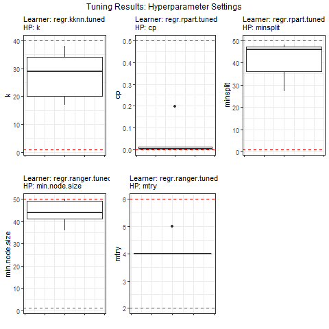
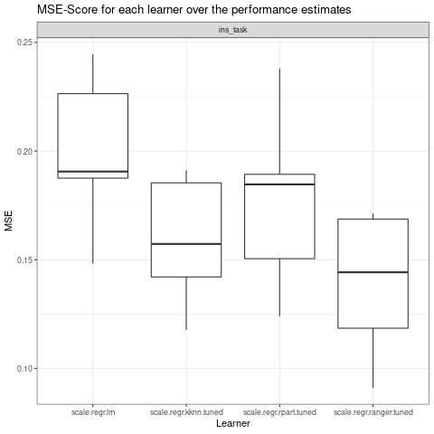
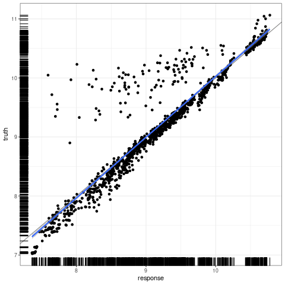

```{r, include=FALSE}
knitr::opts_chunk$set(
  echo = TRUE,
  R.options = list(width = 80),
  warning = FALSE,
  message = FALSE
)
lgr::get_logger("mlr3")$set_threshold("warn")
library(kableExtra)
```

```{r setup, include=FALSE}
library(mlr3verse)
library(ggplot2)
library(grid)
library(gridExtra)
library(dplyr)
library(tidyr)
library(RCurl)

longrun = FALSE
```


## Introduction 

Myriad implementations of supervised learning algorithms can be found in a wide range of fields of science and business.
This project serves as an example for an implementation in the actuarial sciences.
It analyses insurance costs based on the following data set: "https://www.kaggle.com/mirichoi0218/insurance".
Applying supervised machine learning methods, we want to investigate the following questions:  

1. Which learner qualifies best to explain insurance charges by means of the given covariates? 
2. What is the unbiased generalisation error associated with the selected model? 
3. Which tariffication criteria (= covariates) have the strongest impact on the charges?  

## Descriptive Analysis of the Data

Below the data are imported and a seed is set for reproducibility.

```{r}
url = getURL("https://raw.githubusercontent.com/stedy/Machine-Learning-with-R-datasets/master/insurance.csv")
insurance = read.csv(text = url)
set.seed(246)
```

The data set consists of 1338 insurees and their respective information on age, sex, bmi, number of children, smoking behaviour and region.
As mentioned above our defined target variable, the outcome, are insurance costs named charges.
These shall be explained by the information given about each insuree.   

```{r, echo = FALSE}
head(insurance)
```

The target variable, charges, is continuous and its distribution is shown below.
It has to be noted, that the variable has been logarithmised in order to avoid the problem of non-normality.

```{r, echo = FALSE}
ggplot(insurance, aes(x = log(charges))) +
  geom_histogram(col = "darkgray") +
  theme_bw()

insurance$charges = log(insurance$charges)
```
Note, that the same result can be achieved more easily by using `PipeOpTargetTrafo` from mlr3pipelines.
This PipeOp provides a smooth implementation to transform the target variable mlr3 tasks.

The following plots give a brief overview of the distribution of the independent variables:   

```{r, echo = FALSE}


age = ggplot(insurance, aes(x = age)) +
  geom_histogram(col = "darkgray", size = 0.5) +
  theme_bw()

sex = ggplot(insurance, aes(sex)) +
  geom_bar() +
  theme_bw()

bmi = ggplot(insurance, aes(x = bmi)) +
  geom_histogram(col = "darkgray", size = 0.5) +
  theme_bw()

children = ggplot(insurance, aes(x = children)) +
  geom_bar() +
  theme_bw() +
  scale_x_continuous(breaks = 0:6, labels = c("0", "1", "2", "3", "4", "5", "6"))

smoker = ggplot(insurance, aes(x = smoker)) +
  geom_bar() +
  theme_bw()

levels(insurance$region)[levels(insurance$region) == "northeast"] = "ne"
levels(insurance$region)[levels(insurance$region) == "northwest"] = "nw"
levels(insurance$region)[levels(insurance$region) == "southeast"] = "se"
levels(insurance$region)[levels(insurance$region) == "southwest"] = "sw"

region = ggplot(insurance, aes(x = region)) +
  geom_bar() +
  theme_bw() +
  theme(axis.text.x = element_text(angle = 45, vjust = 1, hjust = 1))

grid.arrange(age, sex, bmi, children, smoker, region, nrow = 2)
```

Before we resume in our analysis, all independent, metric variables will be standardized.
This ensures commensurability of variables originally measured on differing metric scales and is particularly important for learners, which assess distances between individual observations.
Therefore PipeOpScale from mlr3pipelines is used.

```{r}
insurance[, c("age", "bmi", "children")] =
 scale(insurance[, c("age", "bmi", "children")])
```
Note, that the same result can be achieved more easily by using `PipeOpScale` from mlr3pipelines.
This PipeOp provides a smooth implementation to scale numeric features for mlr3 tasks.


Given the aforementioned continuity of our target variable, we initiate a regression task which specifies the underlying data and the target variable:  

```{r}
ins_task = TaskRegr$new(id = "ins_task", backend = insurance, target = "charges")
```

The plots below give a brief overview of the conditional distribution of charges given each independent variable.
It can, for example, be seen that charges seem to increase with age or that smokers seem to face higher charges than non-smokers.  

```{r echo = FALSE}
age = ggplot() +
  geom_point(data = insurance, aes(x = age, y = charges), col = "grey30") +
  ggtitle("age") +
  xlab("age (standradised)") +
  theme_bw() +
  theme(plot.title = element_text(hjust = 0.5))

bmi = ggplot() +
  geom_point(data = insurance, aes(x = bmi, y = charges), col = "grey30") +
  ggtitle("bmi") +
  xlab("bmi (standradised)") +
  theme_bw() +
  theme(plot.title = element_text(hjust = 0.5))

children = ggplot() +
  geom_point(data = insurance, aes(x = children, y = charges), col = "grey30") +
  ggtitle("children") +
  xlab("children (standradised)") +
  theme_bw() +
  theme(plot.title = element_text(hjust = 0.5))

sex = ggplot() +
  geom_histogram(data = insurance, aes(x = charges), col = "darkgray", size = 0.5) +
  facet_wrap(~sex, ncol = 1) +
  ggtitle("sex") +
  theme_bw() +
  theme(plot.title = element_text(hjust = 0.5))

smoker = ggplot() +
  geom_histogram(data = insurance, aes(x = charges), col = "darkgray", size = 0.5) +
  facet_wrap(~smoker, ncol = 1) +
  ggtitle("smoker") +
  theme_bw() +
  theme(plot.title = element_text(hjust = 0.5))

region = ggplot() +
  geom_histogram(data = insurance, aes(x = charges), col = "darkgray", size = 0.25) +
  facet_wrap(~region, ncol = 2) +
  ggtitle("region") +
  theme_bw() +
  theme(plot.title = element_text(hjust = 0.5))


grid.arrange(age, sex, bmi, children, smoker, region, nrow = 2)
```

The learners we initiate are Linear Model (LM), k-Nearest Neighbors (kNN), Decision Trees (CART) and Random Forest (Ranger).  

```{r}
lrn_lm = lrn("regr.lm")
lrn_kknn = lrn("regr.kknn")
lrn_rpart = lrn("regr.rpart")
lrn_ranger = lrn("regr.ranger")
```

## Model and Hyperparameter Tuning

We first specify the hyperparameters of each learning algorithm - if applicable.
These hyperparameters can have a strong influence on the performance of the algorithm and it can be advantageous to try different settings before fitting the model on the training data.

Depending on the selected learner, various hyperparameters are obtained. Each of them impacts the performance of the learning algorithm. In order to evaluate this performance, we then need to choose a resampling strategy and a performance measure.   

Again, in regression tasks, there is a variety of potential measures of accuracy to compare the performance of each learner, such as Mean Squared Error (MSE), Mean Absolute Error (MAE) and $R^2$. We will calculate all three to check if they come to the same conclusions.  

```{r}
resampling_inner = rsmp("cv", folds = 5)
# measures = list(msr("regr.mse"), msr("regr.mae"), msr("regr.rsq"))
measures = mlr_measures$mget(c("regr.mse", "regr.mae", "regr.rsq"))
```

To find the optimal hyperparameter setting of a model, which result in the most accurate predictions, we need to define the parameter space as well as the class and termination criterion of our tuner.  
This is done by *random search*, where random combinations of hyperparamters are tested to find the best solution in a given space.  

```{r}
tuner_rs = mlr3tuning::tnr("random_search")
```

To determine when to stop tuning a *terminator* is used. Here, we create a terminator which allows for 30 evaluations.

```{r}
terminator = trm("evals", n_evals = 30)
```


## Automating the Tuning of kNN, CART and Ranger

*K-Nearest Neighbors* is a computationally complex procedure but very simple in terms of understanding as well as implementation.
Furthermore, the resulting models often have a high degree of accuracy.
As shown below, the parameter $k$, the number of neighbors, will be optimized as part of the model development.
We specify that $k$-values between 10 and 40 shall be taken into account. 

```{r}
param_set_knn = ParamSet$new(params = list(ParamInt$new("k", lower = 10, upper = 40)))
```

For *CART learners* we choose to optimize two hyperparameters.

- The complexity parameter $cp$ ensures that only splits that improve the overall fit by a factor of $cp$ are attempted. 
- The hyperparameter $minsplit$ determines the minimal number of observations per leaf necessary for a split to be attempted.  

```{r}
param_set_rpart =
  ParamSet$new(params = list(
    ParamDbl$new("cp", lower = 0.001, upper = 0.5),
    ParamInt$new("minsplit", lower = 1, upper = 50)))
```

Finally, for the Random Forest learner, the hyperparameters we choose to optimize are $mtry$, the number of randomly sampled features considered by each tree when splitting a node, and $min.node.size$, the minimum number of observations per node.  

```{r}
param_set_ranger =
  ParamSet$new(params = list(
    ParamInt$new("mtry", lower = 2, upper = 6),
    ParamInt$new("min.node.size", lower = 1, upper = 50)))
```

The *AutoTuner* from the mlr3 package adjusts itself by first tuning the hyperparameters of the respective learner on the training data, then setting the optimal parameters in the learner and finally fitting the model on the complete training data set.  

```{r}
at_knn = AutoTuner$new(
  learner = lrn_kknn,
  resampling = resampling_inner,
  measure = msr("regr.mse"),
  search_space = param_set_knn,
  terminator = terminator,
  tuner = tuner_rs
)
at_rpart = AutoTuner$new(
  learner = lrn_rpart,
  resampling = resampling_inner,
  measure = msr("regr.mse"),
  search_space = param_set_rpart,
  terminator = terminator,
  tuner = tuner_rs
)
at_ranger = AutoTuner$new(
  learner = lrn_ranger,
  resampling = resampling_inner,
  measure = msr("regr.mse"),
  search_space = param_set_ranger,
  terminator = terminator,
  tuner = tuner_rs
)
```

```{r grid1, echo=FALSE, eval=longrun}
resampling_outer = rsmp("cv", folds = 5)

grid = benchmark_grid(
  task = ins_task,
  learner = list(lrn_lm, at_knn, at_rpart, at_ranger),
  resampling = resampling_outer
)

bmr = benchmark(grid, store_models = TRUE)

# Each fold of outer resampling computes tuning, i.e. there are different sets of tuned hyperparameters
# Extract optimal HP for each fold of outer resampling:

knn = bmr$score()[learner_id == "regr.kknn.tuned"]$learner
hp_knn = data.frame(
  iteration = seq(1:resampling_outer$iters),
  k = NA)
for (i in 1:resampling_outer$iters) {
  hp_knn$k[i] = knn[[i]]$tuning_result$params
}

plot_hp_knn = ggplot(data = hp_knn) +
  geom_boxplot(aes(x = 1, y = unlist(k))) +
  ylim(c(10, 40)) +
  geom_hline(yintercept = 10, col = "red", linetype = "dashed") +
  geom_hline(yintercept = 40, col = "red", linetype = "dashed") +
  labs(y = "k", x = "", subtitle = "Learner: kNN \nHP: k") +
  theme_bw() +
  theme(axis.text.x = element_blank())

rpart = bmr$score()[learner_id == "regr.rpart.tuned"]$learner
hp_rpart = data.frame(
  iteration = seq(1:resampling_outer$iters),
  cp = NA,
  minsplit = NA)
for (i in 1:resampling_outer$iters) {
  hp_rpart$cp[i] = rpart[[i]]$tuning_result$params$cp
  hp_rpart$minsplit[i] = rpart[[i]]$tuning_result$params$minsplit
}

plot_hp_rpart_1 = ggplot(data = hp_rpart) +
  geom_boxplot(aes(x = 1, y = unlist(cp))) +
  ylim(c(0.001, 0.5)) +
  geom_hline(yintercept = 0.001, col = "red", linetype = "dashed") +
  geom_hline(yintercept = 0.5, col = "red", linetype = "dashed") +
  labs(y = "cp", x = "", subtitle = "Learner: Decision Trees \nHP: cp") +
  theme_bw() +
  theme(axis.text.x = element_blank())

plot_hp_rpart_2 = ggplot(data = hp_rpart) +
  geom_boxplot(aes(x = 1, y = unlist(minsplit))) +
  ylim(c(1, 50)) +
  geom_hline(yintercept = 1, col = "red", linetype = "dashed") +
  geom_hline(yintercept = 50, col = "red", linetype = "dashed") +
  labs(y = "minsplit", x = "", subtitle = "Learner: Decision Trees \nHP: minsplit") +
  theme_bw() +
  theme(axis.text.x = element_blank())

ranger = bmr$score()[learner_id == "regr.ranger.tuned"]$learner
hp_ranger = data.frame(
  iteration = seq(1:resampling_outer$iters),
  # num.trees = NA,
  mtry = NA,
  min.node.size = NA
)
for (i in 1:resampling_outer$iters) {
  hp_ranger$mtry[i] = ranger[[i]]$tuning_result$params$mtry
  hp_ranger$min.node.size[i] = ranger[[i]]$tuning_result$params$min.node.size
}


plot_hp_ranger_1 = ggplot(data = hp_ranger) +
  geom_boxplot(aes(x = 1, y = unlist(min.node.size))) +
  ylim(c(1, 50)) +
  geom_hline(yintercept = 1, col = "red", linetype = "dashed") +
  geom_hline(yintercept = 50, col = "red", linetype = "dashed") +
  labs(y = "min.node.size", x = "", subtitle = "Learner: Random Forest \nHP: min.node.size") +
  theme_bw() +
  theme(axis.text.x = element_blank())

plot_hp_ranger_2 = ggplot(data = hp_ranger) +
  geom_boxplot(aes(x = 1, y = unlist(mtry))) +
  ylim(c(2, 6)) +
  geom_hline(yintercept = 2, col = "red", linetype = "dashed") +
  geom_hline(yintercept = 6, col = "red", linetype = "dashed") +
  labs(y = "mtry", x = "", subtitle = "Learner: Random Forest \nHP: mtry") +
  theme_bw() +
  theme(axis.text.x = element_blank())

grid.arrange(plot_hp_knn, plot_hp_rpart_1, plot_hp_rpart_2, plot_hp_ranger_1, plot_hp_ranger_2,
  nrow = 2,
  top = textGrob("Tuning Results: Hyperparameter Settings", gp = gpar(fontface = 2, fontsize = 14)))
```



These plots show the range of optimal hyperparameters obtained by the inner resampling loop.
So, each boxplot is based on 5 values. The red lines (dashed) indicate the range, within which the hyperparameters were optimized.
It can, for example, be seen that while various different $k$-values are deemed optimal for kNN, $mtry = 4$ is determined the optimal setting for the Ranger algorithm in every iteration.
Also, the optimal $cp$ in CART seems to lie within a small range, while the best-performing $minsplit$-parameter is rather volatile.
However, the illustration neglects the fact that in tuning we are looking at combinations of hyperparameters and the more dimensions we consider, the fewer of the hyperparameter space we are investigating with a fixed number of evaluations in the tuning.    

### Outer Loop: Model Selection

For nested resampling, we also define a 5-fold cross validation as our  outer loop.
This means, we obtain five pairs of training and test sets. Each of those initiates the tuning process for the hyperparameter spaces specified earlier. 
For each of the five iterations, the learner is fitted on the outer training set while its performance is evaluated on the outer test set.
By averaging these five performance estimates of the outer loops, we get an unbiased performance estimate for the learner.  

As mentioned earlier, we aim to compare the performance of different learning algorithms on the prediction of insurance costs.
By initiating a benchmarking process, we can combine all candidate models in one single nested resampling process.
All we have to do is to define a grid with the regression task, the (tuned) learners and the outer resampling strategy.  

```{r benchmark, echo=TRUE, eval=longrun}
resampling_outer = rsmp("cv", folds = 5)

grid = benchmark_grid(
  task = ins_task,
  learner = list(lrn_lm, at_knn, at_rpart, at_ranger),
  resampling = resampling_outer
)

bmr = benchmark(grid, store_models = TRUE)
```

This part of the analysis can be computationally demanding.
With our termination criterion of 30 evaluations in the tuning process, a 5-fold CV in the inner loop and another 5-fold CV in the outer loop, a total of 755 models is fitted for each learner that requires tuning and another 5 models for the Linear Model, which doesn't have hyperparameters to optimize.
Overall, in our example the benchmarking fits 2270 models, which in turn allow for us to make a decision on the best model and its generalization error.  


```{r echo=FALSE, eval=longrun}
scores = bmr$score(measures) %>%
  select(Learner = learner_id, Iteration = iteration, MSE = regr.mse)

plot_bmr = autoplot(bmr) +
  labs(x = "Learner", y = "MSE", title = "MSE-Score for each learner over the performance estimates") +
  theme_bw()
plot_bmr
```



Benchmarking generates scores for each learner and each outer loop iteration.
Drawing boxplots over the performance estimates - here the Mean Squared Error - shows that kNN seems to work fine but produces some variation in performance estimates.
The Linear Model doesn't deliver satisfactory results and produces large MSEs compared to the other candidate learners.
Random Forest appears to be the best model producing accurate predictions in terms of the MSE.
Finally, Decision Trees produce performance estimates similar to those of kNN, with even smaller variability.  

One of our initial questions was: Which learner qualifies best to predict insurance charges - that is, as accurately as possible?  

To come to answer this question, we do not necessarily have to study the boxplots - though it might be helpful.
Instead, we can access the aggregated performance estimates for each learner, directly.
In the graphic below the learners are ranked according to our three performance measures:
MSE, MAE and $R^2$.
The inverse value of $R^2$ has been computed and plotted to allow for easy comparison; improvements are indicated by lower values in each of the three plots.

```{r, eval=longrun, echo=FALSE}
tab = bmr$aggregate(measures)

ranks = tab[, .(learner_id, regr.mse, rank_mse = rank(regr.mse), regr.mae, rank_mae = rank(regr.mae), inv_regr.rsq = 1 / regr.rsq, rank_rsq = rank(-regr.rsq))]

saveRDS(ranks, "ranks.rds")
```

```{r tabrds, echo=FALSE, eval=!longrun}
ranks = readRDS("ranks.rds")
```


```{r echo=FALSE, eval=TRUE}
ranks = ranks %>% pivot_longer(c(regr.mse, regr.mae, inv_regr.rsq), names_to = "key", values_to = "value")
ranks$key = factor(ranks$key, levels = c("regr.mse", "regr.mae", "inv_regr.rsq"))

# Visualization
ggplot(data = ranks) +
  geom_point(aes(x = key, y = value, col = as.factor(learner_id)), size = 5) +
  facet_wrap(~key,
    scales = "free",
    labeller = as_labeller(c("regr.mse" = "MSE", "regr.mae" = "MAE", "inv_regr.rsq" = "Inverse of R^2"))) +
  theme_bw() +
  theme(axis.text.x = element_blank(), axis.title = element_blank(), legend.position = "right") +
  scale_color_discrete(labels = c(
    "regr.kknn.tuned" = "kNN (tuned)",
    "regr.lm" = "LM",
    "regr.ranger.tuned" = "Ranger (tuned)",
    "regr.rpart.tuned" = "CART (tuned)")) +
  labs(col = "Learner")
```


But what about the hyperparameters?
We just learned that from nested resampling we obtain five different sets of optimal combinations:
Which one of them shall we use for the final model?  

The answer is: none of them.
Unlike before, the final model is fit on the whole dataset and includes its own tuning step and resampling.
The major difference is that there is no outer loop.
Based on the tuning results, the model is trained on the whole dataset. 


```{r eval=longrun}
lgr::get_logger("mlr3")$set_threshold("warn")
learner = lrn("regr.ranger", importance = "impurity")

# Autotuning to find the optimal hyperparameter configuration
# based on the complete dataset:
at_ranger_final = AutoTuner$new(
  learner = learner,
  resampling = resampling_inner,
  measure = msr("regr.mse"),
  search_space = param_set_ranger,
  terminator = terminator,
  tuner = tuner_rs
)

# Train the model:
at_ranger_final$store_tuning_instance = TRUE
at_ranger_final$train(ins_task)
```

```{r eval=longrun, echo=FALSE}
tab_tuning = at_ranger_final$archive$data()[, c("batch_nr", "regr.mse", "min.node.size", "mtry")]

saveRDS(tab_tuning, file = "tab_tuning.rds")
```

```{r tabtuningrds, echo=FALSE, eval=!longrun}
tab_tuning = readRDS("tab_tuning.rds")
learner = lrn("regr.ranger", importance = "impurity")
```

From the tuning process of our final model, we conlude that the optimal hyperparameter setting is achieved through the combination of $min.node.size = 30$ and $mtry = 4$.
The figure below illustrates the investigated parameter combinations via random search.
The color intensity matches the value of the respective MSE and the hyperparameter combination with the best performance, which is used to train the model, is highlighted in red.  

```{r echo=FALSE, eval=TRUE}
ggplot() +
  geom_point(aes(x = min.node.size, y = mtry, fill = regr.mse, col = regr.mse), data = tab_tuning, size = 5, shape = 21) +
  geom_point(aes(x = min.node.size, y = mtry, fill = regr.mse), data = tab_tuning[regr.mse == min(tab_tuning$regr.mse), ], col = "red", size = 5, shape = 21, stroke = 2) +
  annotate("text",
    x = tab_tuning$min.node.size[tab_tuning$regr.mse == min(tab_tuning$regr.mse)],
    y = tab_tuning$mtry[tab_tuning$regr.mse == min(tab_tuning$regr.mse)], col = "red", label = "min", vjust = -1) +
  labs(title = "Visualization of Tuning Results", subtitle = "Random Search, Termination after 30 evaluations") +
  theme_bw() +
  labs(fill = "MSE", col = "MSE")
```

Eventually, we want to investigate how well the final model can explain the data observed. Overall, the model fit does not seem too bad: the majority of observations are close to the diagonal.
There is, however, a considerable number of observations with charges higher than the ones predicted by the model.
This could indicate that features are not considered with their true functionality or that the insurance company uses additional tariffication criteria outside the data set.

```{r echo = FALSE, eval=longrun}
# Compare predicted values to true values:
autoplot(at_ranger_final$predict(ins_task)) +
  theme_bw()
```



## Feature Importance

As a last step of our analysis, we want to shed some light onto the functionality of our final "black box" model.
To get a better understanding of the predictions made, we investigate the importance of each individual covariate.
This can be done with the help of filter methods, which assign an importance value to each feature, which will then be ranked.
For the Ranger learning algorithm, we can make use of the filter methods embedded in the mlr3-package.  

```{r}
filter = flt("importance", learner = learner)
filter$calculate(ins_task)
```


```{r echo = FALSE}
var = as.data.table(filter)
var$rank = 7 - rank(var$score)
var[order(var$rank), ] %>%
  kable() %>%
  kable_styling(full_width = F)

ggplot(data = var, aes(x = feature, y = score)) +
  geom_bar(stat = "identity") +
  labs(x = "Features", y = "Feature Importance") +
  theme_bw()
```


When looking at *impurity* as a measure of importance, we can see that first and foremost, the smoking status determines the predicted value of insurance charges.
This is followed by age.
The bmi, on the other hand, doesn't seem to have a strong impact on the predicted charges and similarly, the remaining features (children, region and sex) lead to minor improvements in impurity only.
Overall, these findings are supported by domain knowledge and are in line with the descriptive analysis mentioned above.  


## Summary and Implications

Our analysis solves the regression task of predicting insurance charges by computing a supervised machine learning model.
Among a selection of candidate models, we identify Random Forest as the preferred learning algorithm.

The scope of our project was limited by factors like time and computing power.
To improve the analysis other learning algorithms, resampling strategies and tuning configurations could be tested.
Moreover, advanced feature selection and feature engineering may improve the model's performance estimate.
Lastly, to save computational power, the models could be refitted without those features, which were identified as least important based on the impurity measure.
